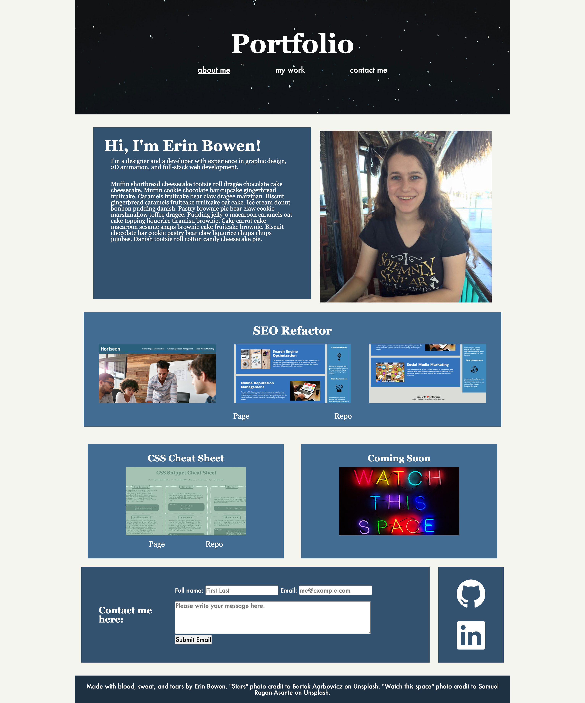

# Erin Bowen's Portfolio

[Link to my project](https://github.com/uiido/portfolio)

[Link to my project page](https://uiido.github.io/portfolio/)

## Table of Contents
- [Description](#description)
- [Visuals](#visuals)

## Description

This project is a mock-up website portfolio for Erin Bowen. This website is meant to practice SEO, semantic codes, html, css, and flexbox. This website is used to showcase Erin Bowen's projects.

## Visuals

